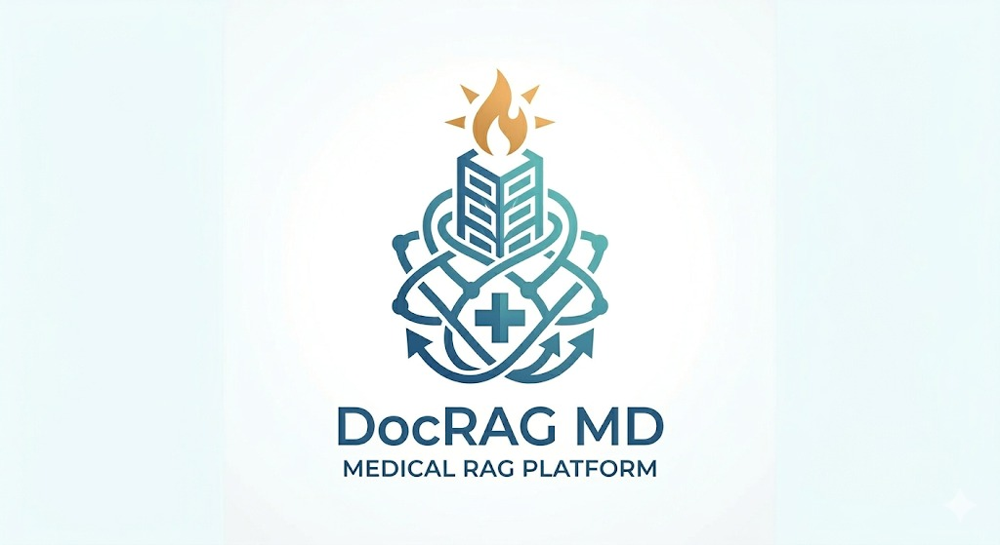
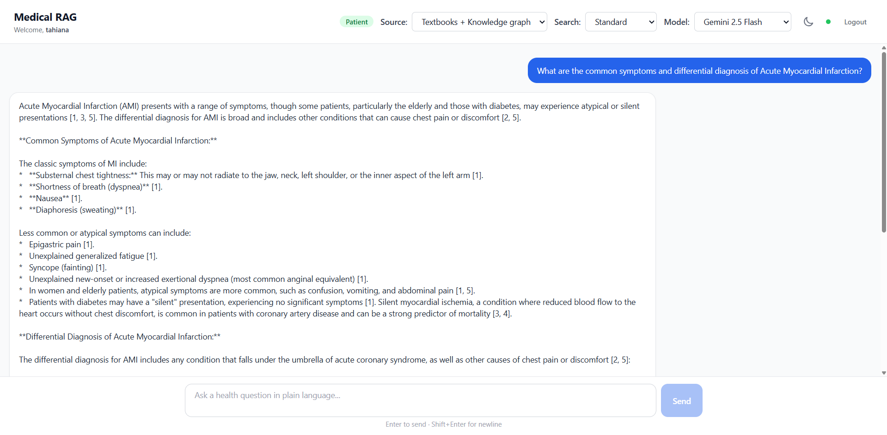
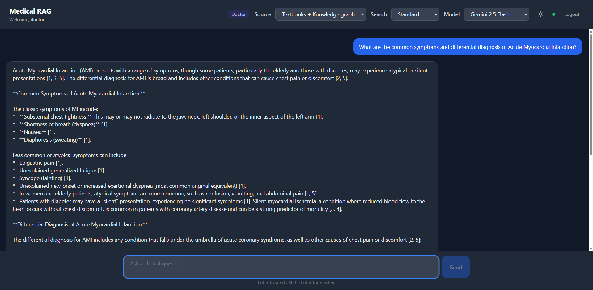
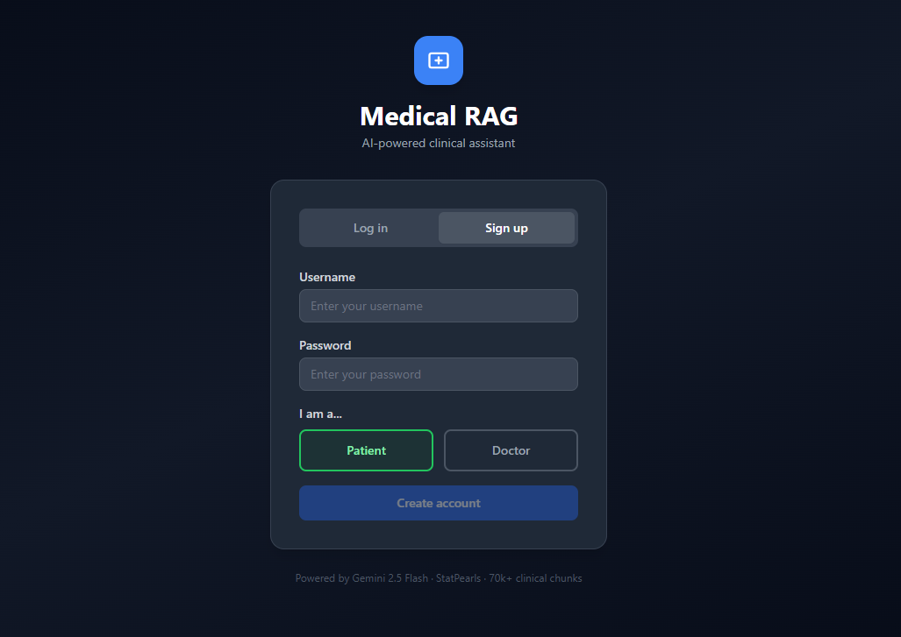
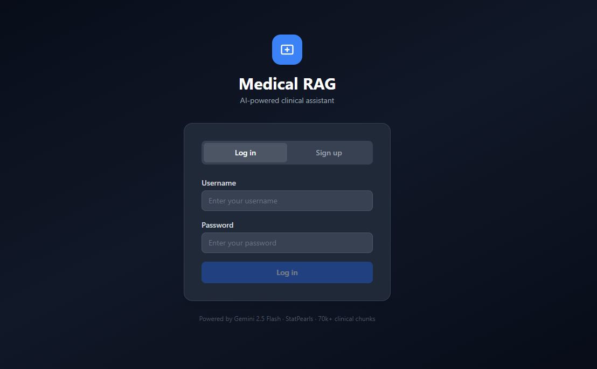
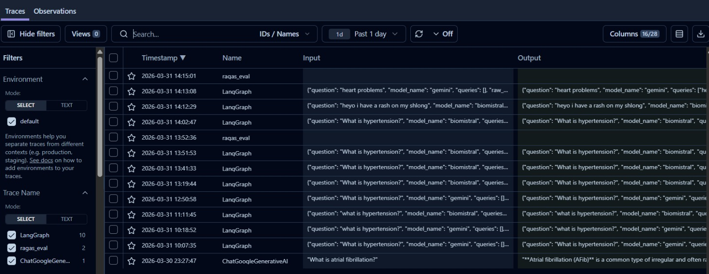
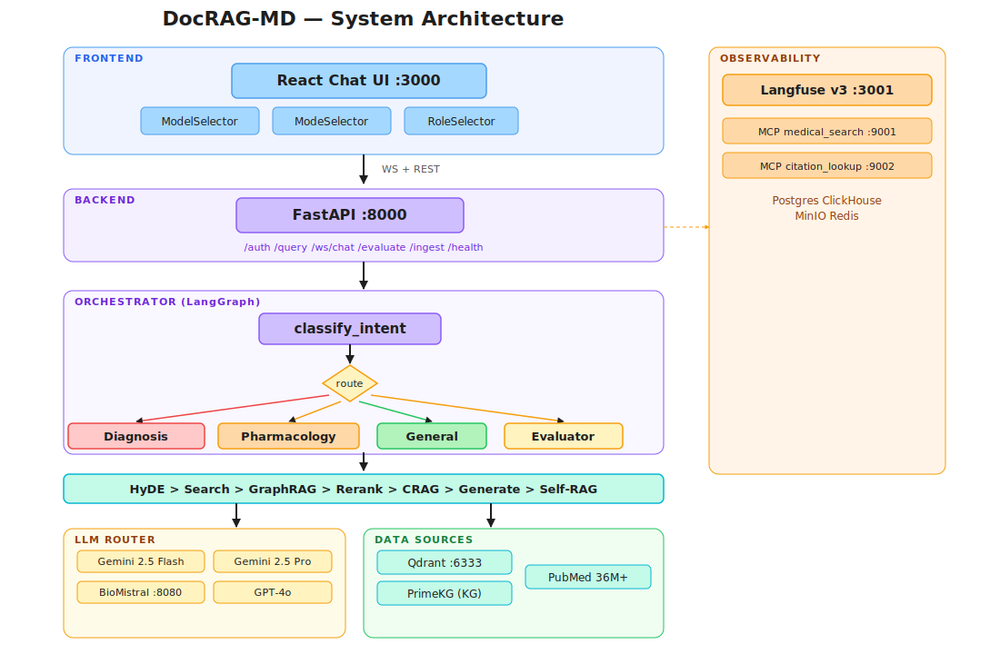
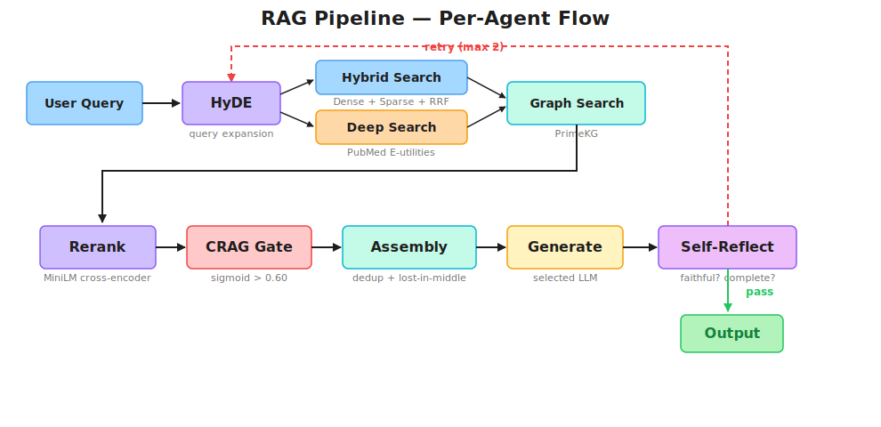
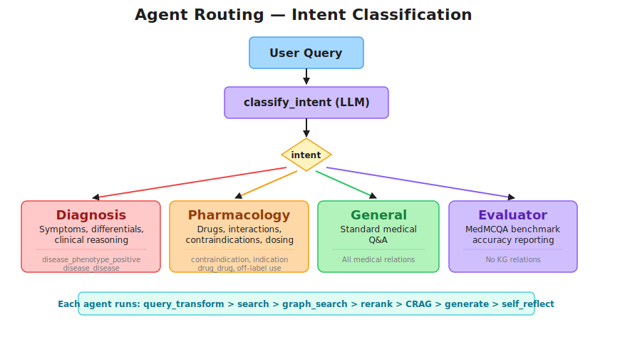

<div align="center">
  
  <h1>DocRAG-MD — Multi-Agent Medical RAG Platform</h1>
  <p><b>Production-grade clinical Q&A with multi-agent routing, GraphRAG, Self-RAG, and Deep Search over 301k StatPearls chunks</b></p>
  <p>
    
    
    
    
    
    
    
    
  </p>
</div>

---

## 📸 Screenshots

<div align="center">
<p float="left">
  
  
</p>
<p float="left">
  
  
  
</p>
</div>

---

## 📋 About

An LLM orchestrator classifies user intent and routes queries to **4 specialized LangGraph agents** (diagnosis, pharmacology, general, evaluator). Users pick from **4 LLMs** (Gemini 2.5 Flash, Gemini 2.5 Pro, BioMistral 7B local, GPT-4o), **4 source modes** (clinical textbooks, knowledge graph, hybrid, PubMed), and a **Deep Search** mode with multi-step retrieval and real-time traces. A role selector (patient / doctor) adapts the response style.

**Three technical differentiators:** **GraphRAG** via PrimeKG (100k+ nodes, 4M+ edges, 9 medical relations), **Self-RAG** post-generation fidelity/completeness checks (max 2 retries), and **CRAG** confidence gating (sigmoid > 0.60). The knowledge base is **301k StatPearls chunks** + **36M+ PubMed articles** (live API).

**Result:** 62%+ accuracy on 150 MedMCQA questions (vs ~52% baseline). Runs as 11 Docker services with Langfuse v3 observability and 2 MCP servers.

<details>
<summary><b>Key features (click to expand)</b></summary>

| Feature | Description |
|---|---|
| **Multi-Agent Orchestrator** | LLM-based intent classification → routes to 4 specialized LangGraph agents |
| **GraphRAG** | PrimeKG — 9 medical relations (`indication`, `contraindication`, `off-label use`, `drug_drug`, `drug_effect`, `disease_phenotype_positive/negative`, `disease_disease`, `disease_protein`) |
| **Self-RAG** | Post-generation fidelity + completeness check — auto-reformulates on failure (max 2 retries) |
| **Deep Search** | LangGraph multi-step retrieval — query decomposition, source drill-down, follow-up queries, real-time trace streaming |
| **PubMed Search** | PubMed E-utilities API (36M+ articles) — esearch → esummary → efetch abstracts |
| **Hybrid Retrieval** | Dense (PubMedBERT 768-dim) + Sparse (BM25) with Reciprocal Rank Fusion (k=60) |
| **CRAG Gate** | Sigmoid-normalized reranker scores — threshold > 0.60 |
| **HyDE** | Hypothetical Document Embeddings for expanded query matching |
| **Lost-in-Middle** | Context reordering — best chunks at positions 0 and -1 |
| **MCP Servers** | `medical_search` (:9001) + `citation_lookup` (:9002) via fastmcp |
| **Langfuse v3** | Full LLM observability — traces, spans, generations, ClickHouse analytics |

</details>

<details>
<summary><b>Tech stack</b></summary>

| Component | Technology | Role |
|---|---|---|
| **Language** | Python 3.11 | Backend runtime |
| **Package Manager** | [uv](https://github.com/astral-sh/uv) + `pyproject.toml` | Dependency management |
| **LLMs** | Gemini 2.5 Flash · Gemini 2.5 Pro · BioMistral 7B (Q4_K_M) · GPT-4o | Cloud + local inference |
| **LLM Framework** | LangChain LCEL + LangGraph | Chains and agent orchestration |
| **Vector DB** | Qdrant | Dense (768-dim cosine) + sparse (BM25) named vectors |
| **Embeddings** | PubMedBERT (`pritamdeka/PubMedBERT-mnli-snli-scinli-scitail-mednli-stsb`) | Biomedical dense embeddings |
| **Reranker** | `cross-encoder/ms-marco-MiniLM-L-6-v2` | Cross-encoder rescoring |
| **Knowledge Graph** | PrimeKG + NetworkX MultiGraph | 100k+ nodes, 4M+ edges, pickle cache |
| **API** | FastAPI + WebSocket | REST and streaming endpoints |
| **MCP** | fastmcp (Streamable HTTP) | Tool-augmented retrieval servers |
| **Frontend** | React 18 + Vite + TailwindCSS | Chat UI with model/mode selectors |
| **Observability** | Langfuse v3 | Traces, spans, cost tracking |
| **Infra** | Docker Compose (11 services) | Full-stack orchestration |

</details>

---

## 🏗️ Architecture

<p align="center">
  <a href="https://raw.githubusercontent.com/tahianahajanirina/DocRAG-MD/tahiana/docs/diagrams/architecture.svg">
    
  </a>
</p>

<p align="center">
  <a href="https://raw.githubusercontent.com/tahianahajanirina/DocRAG-MD/tahiana/docs/diagrams/rag_pipeline.svg">
    
  </a>
</p>

<details>
<summary>ASCII text version</summary>

```
┌────────────────────── REACT FRONTEND  :3000 ───────────────────────┐
│  Chat UI · ModelSelector (Gemini Flash / Pro / BioMistral / GPT-4o) │
│           ModeSelector  (RAG / Graph / Hybrid / Deep Search)       │
│           RoleSelector  (Patient / Doctor)                         │
└────────────────────────────┬───────────────────────────────────────┘
                             │ WebSocket + REST
┌────────────────────────────▼───────────────────────────────────────┐
│                    FASTAPI BACKEND  :8000                           │
│   /auth · /query · /ingest · /evaluate · /health · WS /ws/chat     │
├────────────────────────────────────────────────────────────────────┤
│  ORCHESTRATOR (LangGraph StateGraph)                                │
│    classify_intent → route_to_agent                                 │
│    ├─ DIAGNOSTIC      → Diagnosis Agent                             │
│    ├─ PHARMACOLOGIE   → Pharmacology Agent                          │
│    ├─ GENERAL         → General Agent                               │
│    └─ BENCHMARK       → Evaluator Agent                             │
├────────────────────────────────────────────────────────────────────┤
│  LLM ROUTER                                                        │
│    biomistral  → llama.cpp (:8080)                                  │
│    gemini      → Gemini 2.5 Flash (Vertex AI)                       │
│    gemini-pro  → Gemini 2.5 Pro (Vertex AI)                         │
│    gpt4o       → GPT-4o (API)                                       │
└────────────────────────────────────────────────────────────────────┘
```

</details>

---

## 🤖 Agents

<p align="center">
  <a href="https://raw.githubusercontent.com/tahianahajanirina/DocRAG-MD/tahiana/docs/diagrams/agent_routing.svg">
    
  </a>
</p>

| Agent | Intent | Specialty | PrimeKG Relations |
|---|---|---|---|
| **Diagnosis** | `DIAGNOSTIC` | Symptoms, differential diagnosis | `disease_phenotype_positive`, `disease_disease` |
| **Pharmacology** | `PHARMACOLOGIE` | Drugs, interactions, dosing | `contraindication`, `indication`, `drug_drug`, `off-label use` |
| **General** | `GENERAL` | Standard medical QA | All medical relations |
| **Evaluator** | `BENCHMARK` | MedMCQA accuracy reporting | N/A |

Each agent runs: **HyDE → search → graph_search → rerank → CRAG → assemble → generate → self_reflect** (max 2 retries).

---

## 🚀 Getting Started

```bash
# 1. Clone and configure
git clone https://github.com/Ahmedfekhfakh/DocRAG-MD-.git && cd DocRAG-MD-
cp .env.example .env        # Edit: set GOOGLE_API_KEY=AIza...

# 2. Download data (~6 GB)
bash download_data.sh        # StatPearls + BioMistral GGUF

# 3. Launch
docker compose up --build
```

**Frontend:** `http://localhost:3000` — **API docs:** `http://localhost:8000/docs` — **Langfuse:** `http://localhost:3001`

<details>
<summary><b>Manual installation (without Docker for the app)</b></summary>

```bash
curl -LsSf https://astral.sh/uv/install.sh | sh
uv venv --python 3.11 && source .venv/bin/activate && uv pip install -e .
docker run -d -p 6333:6333 -v qdrant_storage:/qdrant/storage qdrant/qdrant
export QDRANT_HOST=localhost GOOGLE_API_KEY=AIza...
bash download_data.sh 5000
python -m ingestion.pipeline
uvicorn api.main:app --host 0.0.0.0 --port 8000
```

</details>

---

## 📈 Benchmark

| Metric | Baseline | DocRAG-MD |
|---|---|---|
| **MedMCQA Accuracy** (150 questions) | ~52% | **62%+** |

Self-RAG retry improves accuracy by ~2-3%. **40 tests** pass (`uv run pytest tests/ -v`).

---

## 📖 Reference

<details>
<summary><b>API Reference (6 endpoints)</b></summary>

**`GET /health`** → `{ "status": "ok", "qdrant": "ok", "version": "0.1.0" }`

**`POST /auth/signup`**
```json
{ "username": "john", "password": "secret", "role": "doctor" }
→ { "id": 1, "username": "john", "role": "doctor" }
```

**`POST /auth/login`**
```json
{ "username": "john", "password": "secret" }
→ { "id": 1, "username": "john", "role": "doctor" }
```

**`POST /query`**
```json
// Request
{
  "question": "First-line treatments for hypertension?",
  "model": "gemini",        // "gemini" | "gemini-pro" | "biomistral" | "gpt4o"
  "mode": "rag",             // "rag" | "graph" | "hybrid" | "deep_search"
  "search_mode": "standard", // "standard" | "deep"
  "use_cot": false,
  "role": "doctor"
}
// Response
{
  "answer": "ACE inhibitors [1], thiazide diuretics [2]...",
  "sources": [{ "doc_id": "...", "title": "Hypertension", "content": "...", "score": 8.3 }],
  "model": "gemini", "mode": "rag", "search_mode": "standard", "intent": "GENERAL", "is_confident": true
}
```

**`WS /ws/chat`**
```json
// Send
{ "question": "What is diabetes?", "model": "gemini", "mode": "rag", "search_mode": "standard", "role": "doctor" }
// Receive (standard)
{ "type": "answer", "answer": "...", "sources": [...], "intent": "GENERAL" }
// Receive (deep search — includes trace events)
{ "type": "trace", "step": "retrieval", "status": "done", "evidence_count": 12 }
{ "type": "delta", "text": "Diabetes is..." }
{ "type": "answer", "answer": "...", "sources": [...], "search_mode": "deep" }
```

**`POST /evaluate/ragas`**
```json
{ "questions": ["What causes hypertension?"], "model": "gemini" }
→ { "scores": { "faithfulness": 0.85, "answer_relevancy": 0.91 }, "n_samples": 1 }
```

</details>

<details>
<summary><b>MCP Servers</b></summary>

| Server | Tool | Description |
|---|---|---|
| `medical_search` | `search(query, top_k)` | Hybrid search + reranking |
| `medical_search` | `search_and_rerank(query, top_k)` | Full rerank pipeline |
| `citation_lookup` | `lookup(doc_id)` | Fetch full article by ID |

```python
from langchain_mcp_adapters.client import MultiServerMCPClient
client = MultiServerMCPClient({
    "medical_search": {"url": "http://localhost:9001/mcp", "transport": "http"},
    "citation_lookup": {"url": "http://localhost:9002/mcp", "transport": "http"},
})
```

</details>

<details>
<summary><b>Environment variables</b></summary>

| Variable | Default | Required | Description |
|---|---|---|---|
| `GOOGLE_API_KEY` | — | **Yes** | Gemini API key (Flash + Pro) |
| `OPENAI_API_KEY` | — | No | GPT-4o API key |
| `BIOMISTRAL_URL` | `http://llama-cpp:8080/v1` | No | Local BioMistral endpoint |
| `QDRANT_HOST` | `qdrant` | No | Qdrant hostname |
| `QDRANT_PORT` | `6333` | No | Qdrant port |
| `COLLECTION_NAME` | `medical_rag` | No | Qdrant collection name |
| `DENSE_MODEL` | `pritamdeka/PubMedBERT-...` | No | HuggingFace embedding model |
| `CRAG_CONFIDENCE_THRESHOLD` | `0.60` | No | CRAG gate cutoff |
| `SELF_RAG_MAX_RETRIES` | `2` | No | Max reflection retries |
| `AUTO_INGEST` | `0` | No | Auto-ingest on startup |
| `LANGFUSE_PUBLIC_KEY` | — | No | Langfuse project key |
| `LANGFUSE_SECRET_KEY` | — | No | Langfuse secret key |
| `DATABASE_URL` | `postgresql://...medrag` | No | Auth database |

</details>

<details>
<summary><b>Docker services (11)</b></summary>

| Service | Port | Role |
|---|---|---|
| `qdrant` | :6333 | Vector database |
| `llama-cpp` | :8080 | BioMistral 7B local inference |
| `api` | :8000, :9001, :9002 | FastAPI + MCP servers |
| `frontend` | :3000 | React chat UI |
| `postgres` | :5432 | Auth + Langfuse metadata |
| `clickhouse` | — | Langfuse analytics |
| `minio` | — | S3-compatible storage |
| `redis` | — | Langfuse cache |
| `langfuse` | :3001 | Observability UI |
| `langfuse-worker` | — | Background jobs |

</details>

<details>
<summary><b>Project structure</b></summary>

```
DocRAG-MD/
├── agents/                          # LangGraph agents
│   ├── orchestrator.py              # Intent classification + routing
│   ├── diagnosis_agent.py           # Diagnostic agent
│   ├── pharmacology_agent.py        # Pharmacology agent
│   ├── general_agent.py             # General RAG + Self-RAG
│   ├── deep_search_agent.py         # Multi-step Deep Search
│   ├── eval_agent.py                # MedMCQA benchmark
│   └── tools.py                     # @tool wrappers
├── retrieval/                       # Search pipeline
│   ├── hybrid_retriever.py          # Dense + sparse RRF
│   ├── reranker.py                  # Cross-encoder
│   ├── crag.py                      # Confidence gate
│   ├── context_assembler.py         # Dedup + citations
│   ├── knowledge_graph.py           # PrimeKG loader
│   ├── deep_search.py               # PubMed E-utilities
│   ├── source_drilldown.py          # Deep Search drill-down
│   ├── self_reflect.py              # Fidelity checker
│   └── query_transform/             # HyDE + decompose
├── generation/                      # LLM chains
│   ├── llm_router.py                # 4-LLM factory
│   ├── generator.py                 # LCEL chains
│   └── prompts/                     # Prompt templates
├── ingestion/                       # Data pipeline
├── api/                             # FastAPI app + routers
├── mcp_servers/                     # MCP tool servers
├── evaluation/                      # Benchmarking
├── frontend/src/                    # React app
├── tests/                           # 40 tests
├── docker-compose.yml               # 11 services
└── pyproject.toml                   # Dependencies
```

</details>

<details>
<summary><b>Troubleshooting</b></summary>

- **Qdrant empty** → `docker compose exec api python -m ingestion.pipeline`
- **HF model re-downloads** → `docker compose down && docker compose up` (hf_cache volume)
- **BioMistral GGUF not found** → `bash download_data.sh`
- **KG cache stale** → `rm -f data/kg_cache.pkl && docker compose restart api`
- **Langfuse not connecting** → create project at `http://localhost:3001`, copy keys to `.env`

</details>

---

## 👥 Authors

| | Name | GitHub |
|---|---|---|
| 👨‍💻 | **Tahiana Andriambahoaka** | [@tahianahajanirina](https://github.com/tahianahajanirina) |
| 👨‍💻 | **Ahmed Fekhfakh** | [@Ahmedfekhfakh](https://github.com/Ahmedfekhfakh) |
| 👨‍💻 | **Oussama Rhouma** | [@oussama10rhouma](https://github.com/oussama10rhouma) |
| 👨‍💻 | **Mohamed Khalil Ounis** | [@AMATERASU11](https://github.com/AMATERASU11) |
| 👨‍💻 | **Mohamed Amar** | |

<p align="center">
  <strong>DocRAG-MD</strong> — Multi-Agent Medical RAG Platform<br>
  StatPearls · PubMed · LangGraph · Qdrant
</p>
